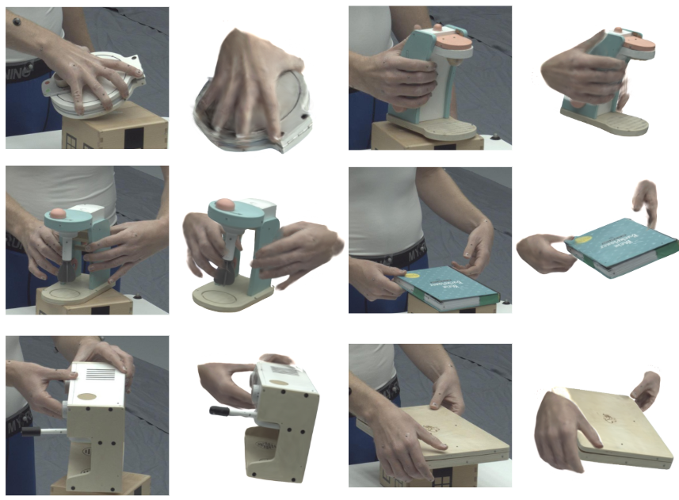
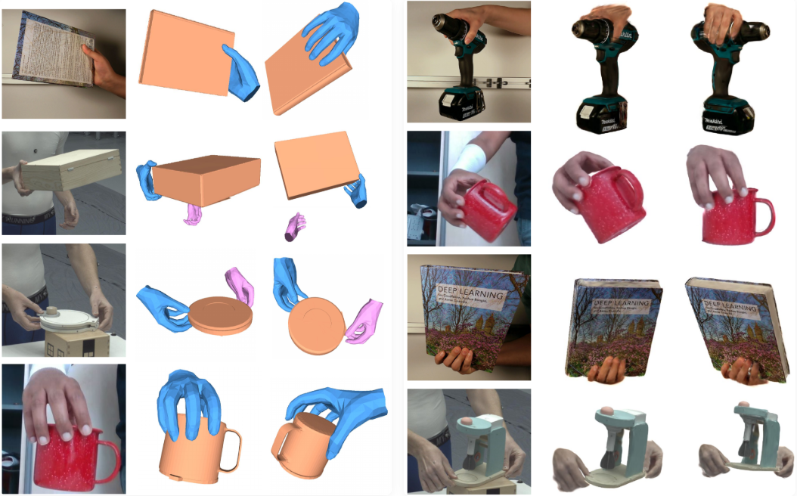
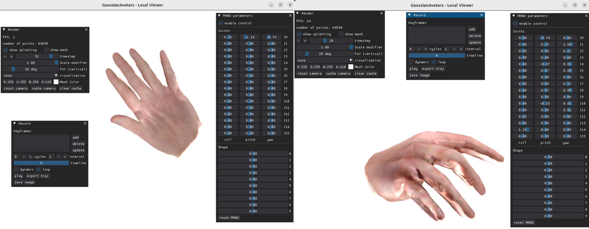

# GHOST: Fast Category-agnostic Hand-Object Interaction Reconstruction from RGB Videos using Gaussian Splatting

### [Project Page](https://ataboukhadra.github.io/ghost/) | [Paper](https://arxiv.org/abs/2603.18912)

**CVPR Findings 2026**

[Ahmed Tawfik Aboukhadra](https://ataboukhadra.github.io/), Marcel Rogge, Nadia Robertini, Abdalla Arafa, Jameel Malik, Ahmed Elhayek, Didier Stricker

<!-- <p align="center">
  
</p> -->

<p align="center">
  
</p>

<p align="center">
  
</p>

## Installation

```bash
git clone --recursive https://github.com/ATAboukhadra/GHOST
cd GHOST

conda create -n ghost python=3.10
conda activate ghost

pip install torch torchvision --index-url https://download.pytorch.org/whl/cu124
conda install -c nvidia -c conda-forge cudatoolkit cudnn cusparselt
pip install --no-build-isolation "git+https://github.com/facebookresearch/pytorch3d.git"

# remove chumpy and detectron2 from hamer requirements
sed -i 's/.*detectron2.*/# &/' submodules/hamer/setup.py
sed -i 's/.*chumpy.*/# &/' submodules/hamer/setup.py

sudo apt-get install libosmesa6-dev
sudo apt-get install libgtk2.0-dev libgtk-3-dev

pip install -r requirements.txt
pip install --no-build-isolation submodules/diff-surfel-rasterization
pip install --no-build-isolation submodules/simple-knn
pip install --no-build-isolation git+https://github.com/NVlabs/nvdiffrast
```

If you plan to use **HLoc**, install `pip install pycolmap==3.13.0` in the main `ghost` environment.

If you plan to use **VGGSfM**, create a separate sub-environment (VGGSfM requires `pycolmap==3.10.0` which is incompatible with HLoc's version):

```bash
conda create -n vggsfm python=3.10 -y
conda activate vggsfm
pip install torch torchvision --index-url https://download.pytorch.org/whl/cu124
pip install pycolmap==3.10.0
pip install vggsfm
```

The preprocessing script will automatically activate this environment when running VGGSfM.

### OpenShape (Optional)

For retrieving geometric priors and object templates:

```bash
conda create -n openshape python=3.10 -y
conda activate openshape
pip install torch==2.4.0 --index-url https://download.pytorch.org/whl/cu124
pip install dgl -f https://data.dgl.ai/wheels/torch-2.4/cu124/repo.html
pip install torch.redstone einops objaverse timm==0.9.12 transformers==4.44.0 open3d
pip install -e submodules/openshape
```

## Models

Download HaMeR checkpoint and place it in `preprocess/`:

```bash
cd preprocess/
gdown https://drive.google.com/uc?id=1mv7CUAnm73oKsEEG1xE3xH2C_oqcFSzT
tar -xvf hamer_demo_data.tar.gz
cd ../
```

Download [MANO models](https://mano.is.tue.mpg.de/) and place them in `preprocess/_DATA/data/mano/`.

## Preprocessing

The `preprocess` directory contains the preprocessing pipeline used to prepare raw video sequences for **GHOST**.
The script `run_single_sequence.sh` processes **one sequence at a time** and performs:

- SAM object segmentation
- Structure-from-Motion (VGG-SfM or HLOC)
- HAMER hand reconstruction
- SAM hand segmentation (1-2 hands)
- Mask combination
- Object prior retrieval (optional)
- Point cloud alignment (optional)
- Scale and MANO refinement
- Hand-Gaussian animation

---

### Usage

Run the script from inside `preprocess/` folder:

```bash
cd preprocess
bash run_single_sequence.sh [OPTIONS]
```

You can use `preprocess/internvl.py` in case you want to generate a text description for the object.

**Example: single hand**

```bash
# add the text description of the object in --prompt. Leave empty if you dont want any geometric priors.
bash run_single_sequence.sh \
    --seq dfki_drill_03 \
    --obj_points "+694,316" \
    --hands 1 \
    --hand_pixels "1381,805" \
    --prompt "drill" \
    --sfm hloc \
    --window 100 \
    --use_prior false \
    --visualize True
```

**Example: two hands with geometric priors**

```bash
# reduce window depending on your GPU memory
bash run_single_sequence.sh \
    --seq arctic_s03_box_grab_01_1 \
    --obj_points "+939,1105" \
    --hands 2 \
    --hand_pixels "470,964,1152,864" \
    --prompt "box" \
    --sfm vggsfm \
    --window 15 \
    --use_prior true \
    --visualize True
```

## Gaussian Splatting

### 1) Object Reconstruction

```bash
bash scripts/train_object.bash arctic_s03_box_grab_01_1
```

### 2) Combined Reconstruction (Single hand and two hands)

```bash
bash scripts/train_combined.bash arctic_s03_box_grab_01_1
```

You can visualize output point clouds on [SuperSplat](https://superspl.at/editor).

## Visualizing Animatable Hand Avatars

We provide a pretrained hand avatar `data/point_cloud.ply` that can be viewed and controlled with MANO parameters and external MANO sequences:

```bash
python3 viewer_mano.py --point_path data/point_cloud.ply --motion_path data/dfki_drill_03/ghost_build/pose_params_right.pt
```

<p align="center">
  
</p>

## Evaluation

The following command evaluates 2D rendering quality and generates PSNR, SSIM, LPIPS metrics for any number of sequences:

```bash
python3 evaluate.py arctic_s03_box_grab_01_1 dfki_drill_03
```

## ARCTIC Bi-CAIR Challenge Submission

The [ARCTIC Bi-CAIR Challenge](https://arctic-leaderboard.is.tuebingen.mpg.de/leaderboard) allows for 3D evaluation on 9 allocentric sequences from the ARCTIC dataset.

In order to export predictions on ARCTIC sequences you need to create a separate environment with PyTorch 1.9.1 as otherwise, the `.save` function in other pytorch versions will create a file format that will fail on the evaluation server.

In addition, we need to download the HOLD checkpoints for the ARCTIC sequences in order to override their predictions with our predictions.

Start off by creating an account on [HOLD Website](https://hold.is.tue.mpg.de/).

To download all the ARCTIC data and their checkpoints created by HOLD:

```bash
cd submodules/hold/
export HOLD_USERNAME=<YOUR_HOLD_USERNAME>
export HOLD_PASSWORD=<YOUR_HOLD_PASSWORD>

# From HOLD instructions
./bash/arctic_downloads.sh
python3 scripts/unzip_download.py
mkdir -p code/logs
mkdir -p code/data
mv unpack/arctic_ckpts/* code/logs/
mv unpack/arctic_data/* code/data/
find downloads -delete # clean up

# To move the arctic frames to our format
cd ../../
bash scripts/mv_arctic_data.bash

# For evaluation purposes patch the following file to point to where our mano models are
sed -i '122s|model_path="./body_models",|model_path="../../../preprocess/_DATA/data/mano/",|' submodules/hold/code/src/model/mano/server.py
```

## Citation

If you find this work useful, please cite:

```bibtex
@inproceedings{aboukhadra2026ghost,
  title     = {GHOST: Fast Category-agnostic Hand-Object Interaction Reconstruction from RGB Videos using Gaussian Splatting},
  author    = {Aboukhadra, Ahmed Tawfik and Rogge, Marcel and Robertini, Nadia and Arafa, Abdalla and Malik, Jameel and Elhayek, Ahmed and Stricker, Didier},
  booktitle = {Proceedings of the IEEE/CVF Conference on Computer Vision and Pattern Recognition (CVPR) Findings},
  year      = {2026}
}
```

## Acknowledgements

We thank the following projects for their open-source code:
[2d-gaussian-splatting](https://github.com/hbb1/2d-gaussian-splatting), [HOLD](https://github.com/zc-alexfan/hold), [GaussianAvatars](https://github.com/ShenhanQian/GaussianAvatars)
and all the other listed submodules.

## Star History

[](https://www.star-history.com/?repos=ATAboukhadra%2FGHOST&type=date&legend=top-left)
